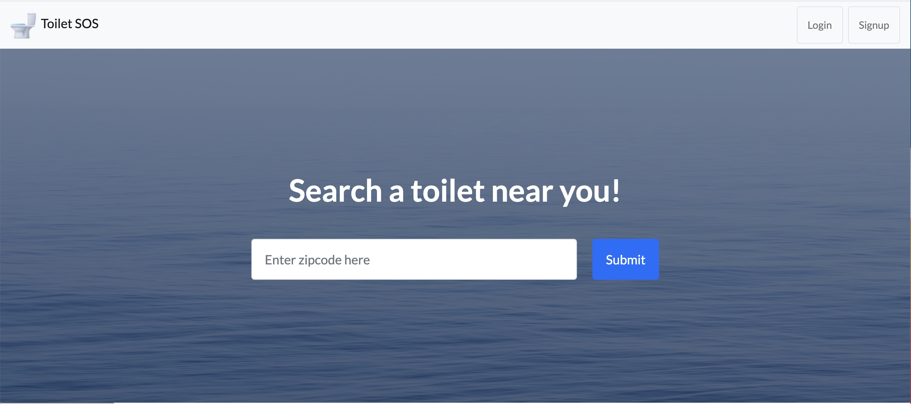

# Toilet SOS
How many times have you needed to go, but don't know where to go or if the bathrrom is safe or clean? We have built a tool to help you in those times of need. 

## Description
This is a program that will find a potty in a given location. You will also have the ability to add a new potty to the database with a review and rating.

## Installation

To install the program, you will need to install the following packages:
<ol>
<li>run npm init -y to install the package.json file. </li>
<li>run npm install to install all the packages and dependencies. </li>
<li>run preloaded npm commands to test the program. </li>
</ol>

## Images 

## Usage
screen shots of the program will be provided.
## Deployed Link 
 Heroku Deployed Link: project-toilet.herokuapp.com
## Contributing Members 
<ul> 
<li>  Eugene </li>
<ol> 
<li><a href="https://github.com/eisforgene" > GitHub </a> </li> 
<li> <a href="mailto:ieugenelee@gmail.com"> Email  </a> </li></ol>

<li> Megan </li>
 <ol> 
 <li><a href="https://github.com/megwatson88"> GitHub </a> </li>
 <li> <a href="mailto:megan.campbell.1988@gmail.com"> Email </a></li>
 </ol>

<li> Anthony</li>
<ol>
<li> <a href="https://github.com/alavezzo"> GitHub</a></li>
<li> <a href="mailto:lavezzo.ae@gmail.com"> Email </a></li>
</ol>

<li>  Daphne </li>
<ol> 
<li> <a href="https://github.com/daphne1014"> GitHub </a></li>
<li> <a href="mailto:daphnesong1014@gmail.com"> Email </a> </li>
</ol>
</ul>

## Tests

## License

MIT License

Copyright (c) [2021] [SOS Toilet]

Permission is hereby granted, free of charge, to any person obtaining a copy
of this software and associated documentation files (the "Software"), to deal
in the Software without restriction, including without limitation the rights
to use, copy, modify, merge, publish, distribute, sublicense, and/or sell
copies of the Software, and to permit persons to whom the Software is
furnished to do so, subject to the following conditions:

The above copyright notice and this permission notice shall be included in all
copies or substantial portions of the Software.

THE SOFTWARE IS PROVIDED "AS IS", WITHOUT WARRANTY OF ANY KIND, EXPRESS OR
IMPLIED, INCLUDING BUT NOT LIMITED TO THE WARRANTIES OF MERCHANTABILITY,
FITNESS FOR A PARTICULAR PURPOSE AND NONINFRINGEMENT. IN NO EVENT SHALL THE
AUTHORS OR COPYRIGHT HOLDERS BE LIABLE FOR ANY CLAIM, DAMAGES OR OTHER
LIABILITY, WHETHER IN AN ACTION OF CONTRACT, TORT OR OTHERWISE, ARISING FROM,
OUT OF OR IN CONNECTION WITH THE SOFTWARE OR THE USE OR OTHER DEALINGS IN THE
SOFTWARE.
